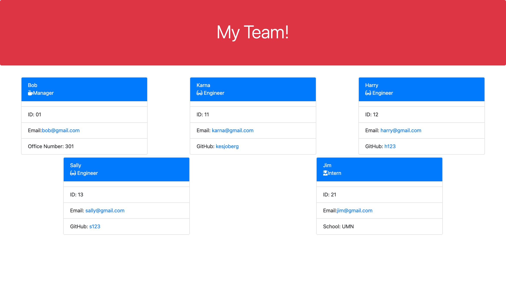

# Homework 10: team-profile-generator

## Objective:

The objective of this assignment was to create a team profile using a series of prompts to collect the information as objects and display each employee on a card that was set-up based on each team member's role. To start, used Inquirer to prompt the questions in Node and then sent the information we received in the object to each the specific role and Employee pages to return the data needed to create a card that was specific to that team member's role. I created the parent class of Employee to handle the responses for Name, Id, and Email since every employee needs that information. Then I set up subclasses for Manager, Engineer and Intern to process the responses that were only specific to that job title. Finally, I passed all the information to the teamBuilder.js file to create the code required to write the team.html file.

Our second objective was to write and run tests using Jest to verify that all of the functions and the types of responses were being returned for the Employee, Manager, Engineer and Intern files. 

## Video Clip of Project
https://watch.screencastify.com/v/qRblzn07UIHviVqi7f9x

## Screenshot of an example team.html

## Link to GitHub Repository
https://github.com/kesjoberg/team-profile-generator
 